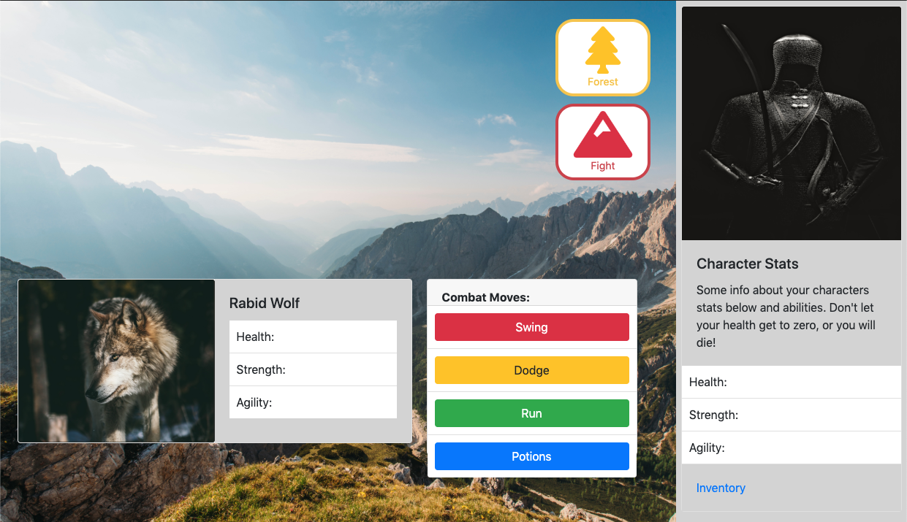

# The-Field-of-Battle

#### Player vs Environment. Single player roleplaying game. Fight through the forest and mountains to win the game! Stock up on coin and potions before you go too far in an adventure!

### Technologies:
HTML, CSS (Grid, Flexbox & Bootstrap), Javascript, minimal jQuery.

#### Link: [Play the game!](https://rperillo1.github.io/The-Field-of-Battle/)

#### How to play:
Create your character. Click the adventure button and go to town. Once in town you can choose to go to the Alchemist to spend some coin or fight in the forest. From there you fight your way to the mountains and if you beat the wolf in the mountains, YOU WIN!

##### Combat moves: 
1. Swing - you attempt to hit the creature, creature attempts to hit back. It's a battle between your strength vs the creatures agility and vice versa. 
2. Dodge - you attempt to dodge the creatures swing in order to get Strength bonus for your next swing! Helps when a creature has high agility, or if you have low strength.
3. Run - you attempt to run away from the creature if it seems too powerful. The chances are slim, but you can try!
4. Potions - health, strength and agility potions available for purchase at the alchemist. Stock up before you battle!

### Next Steps:
1. Use Firebase to store the players info instead of using localStorage
2. Clean up redundent functions and code across files
3. Make game ongoing and not just kill 2 creatures to complete the game
4. Add additional audio elements and flavoring
